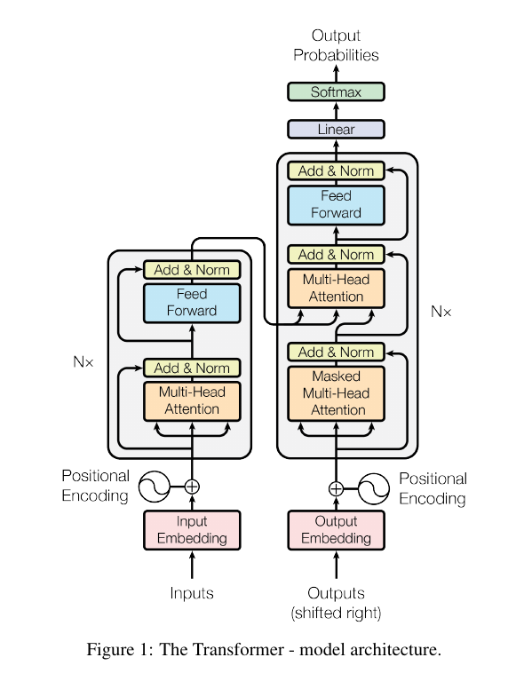
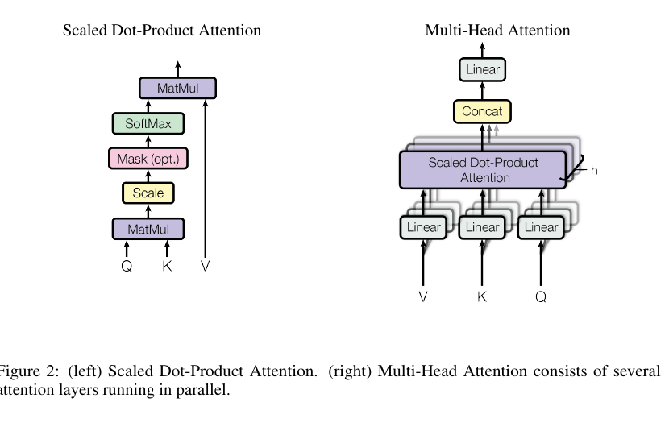
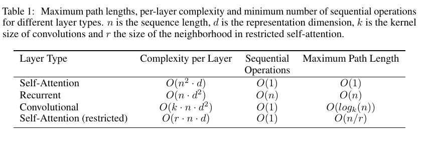
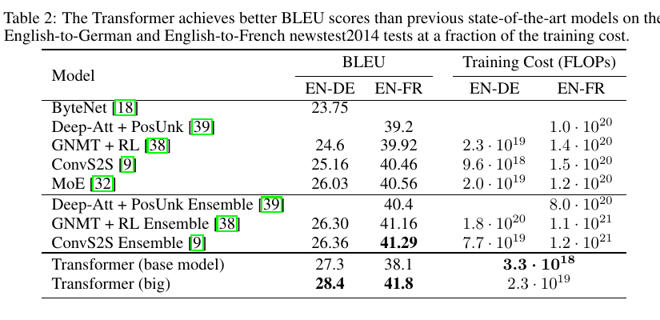
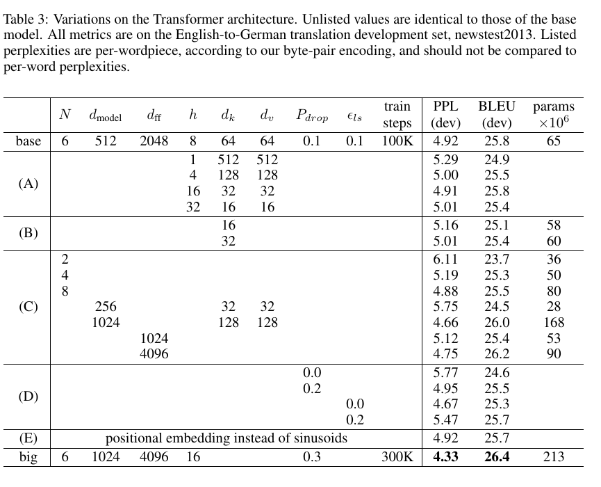
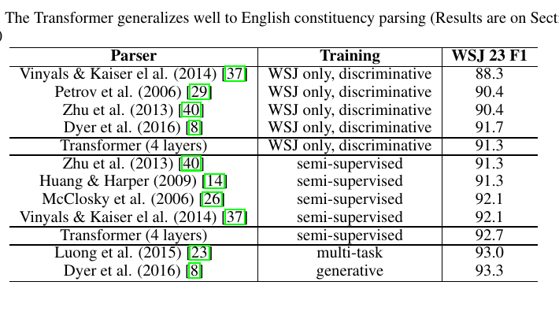
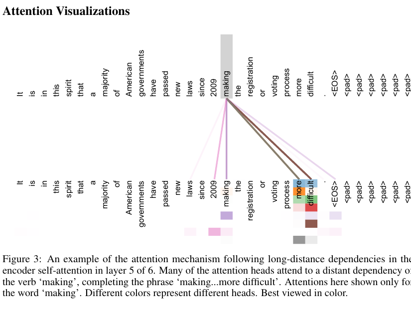
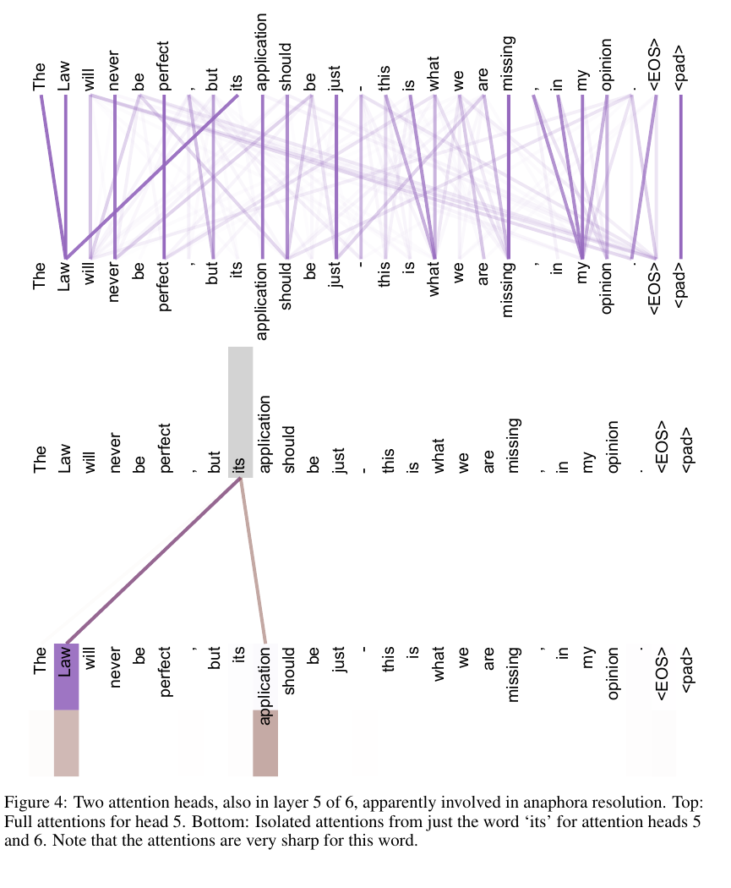
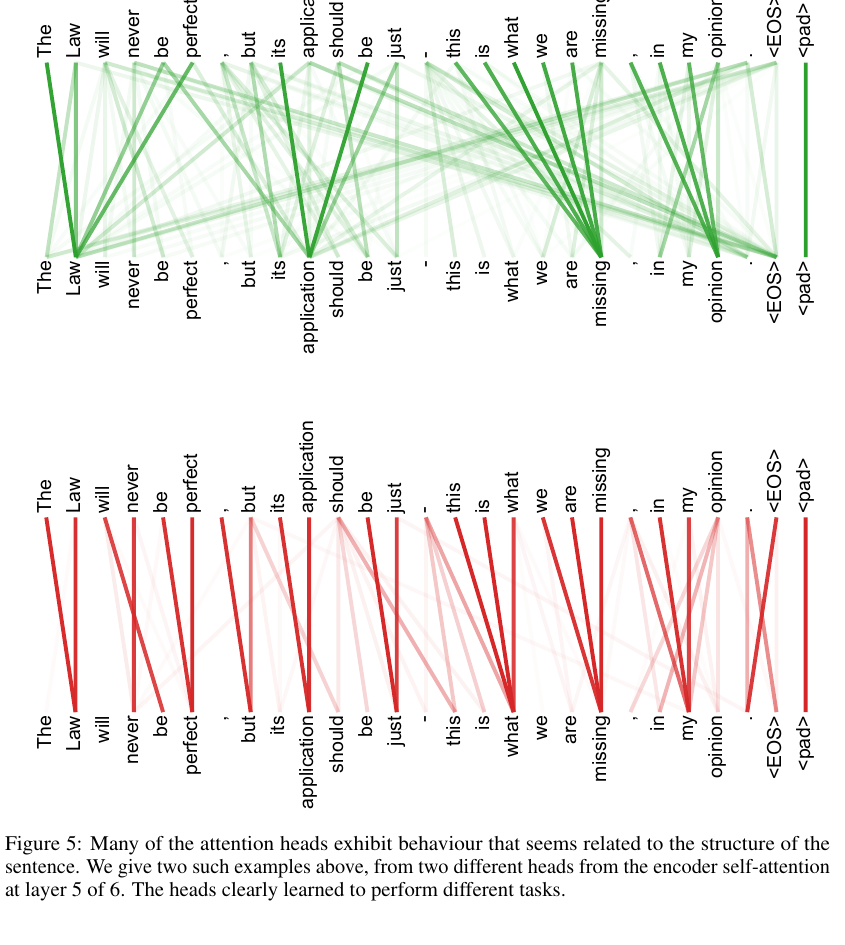

# 《Attention Is All You Need》

> Source: https://arxiv.org/pdf/1706.03762  

## Paper Information

Authors: Ashish Vaswani, Noam Shazeer, Niki Parmar, Jakob Uszkoreit, Llion Jones, Aidan N. Gomez, Łukasz Kaiser, Illia Polosukhin

Institutions: Google Brain; Google Research; University of Toronto

## TL;DR

本文提出 Transformer：一种完全基于注意力机制（attention mechanisms）的编码器-解码器架构，不使用循环网络（recurrence）和卷积（convolutions）。它通过多头自注意力（multi-head self-attention）直接建模序列中任意位置之间的依赖，因此训练并行度更高，长距离依赖路径更短。在 WMT 2014 英德和英法翻译任务上，Transformer 达到当时最优或更优结果，同时训练成本显著降低；论文还展示其能迁移到英文成分句法分析任务。

> [!IMPORTANT] 关键点
> 这篇论文的核心贡献不是“发明注意力”，而是证明“只用注意力也能成为强大的序列转导主干架构”。

## Terms

| English | 中文 | Note |
|---|---|---|
| Transformer | Transformer | 本文提出的模型架构，名称通常不翻译 |
| sequence transduction | 序列转导 | 将一个序列映射为另一个序列，如机器翻译 |
| self-attention / intra-attention | 自注意力 / 内部注意力 | 同一序列内部不同位置之间互相注意 |
| scaled dot-product attention | 缩放点积注意力 | 见 Eq. (1)，用 $1/\sqrt{d_k}$ 缩放点积 |
| multi-head attention | 多头注意力 | 将 $Q/K/V$ 投影到多个子空间并行计算 |
| positional encoding | 位置编码 | 向无循环、无卷积的模型注入顺序信息 |
| residual connection | 残差连接 | 子层输出与输入相加：$x+\operatorname{Sublayer}(x)$ |
| layer normalization | 层归一化 | 残差连接之后进行归一化 |
| label smoothing | 标签平滑 | 正则化方法，改善 BLEU |
| BLEU | BLEU | 机器翻译常用自动评价指标 |

## Annotated Translation

### Abstract

主流的序列转导模型建立在复杂的循环神经网络或卷积神经网络之上，并包含编码器和解码器。表现最好的模型还通过注意力机制连接编码器和解码器。本文提出一种新的简单网络架构 Transformer，它完全基于注意力机制，彻底舍弃循环和卷积。两个机器翻译任务的实验表明，该模型质量更优、并行化程度更高，并且训练所需时间显著更少。模型在 WMT 2014 英译德任务上取得 $28.4$ BLEU，比已有最佳结果（包括集成模型）高出超过 $2$ BLEU；在 WMT 2014 英译法任务上，模型在 $8$ 块 GPU 上训练 $3.5$ 天后，取得 $41.8$ 的单模型 BLEU 新最优成绩，训练成本仅为文献中最佳模型的一小部分。作者还将 Transformer 成功应用到英文成分句法分析，表明它能很好泛化到其他任务。

> [!IMPORTANT] 关键结论
> Transformer 同时解决两个痛点：RNN 的训练串行性，以及远距离依赖需要经过长路径传播的问题。

### 1. Introduction

循环神经网络，尤其是长短期记忆网络（LSTM）[13] 和门控循环神经网络（gated recurrent neural networks）[7]，长期是语言建模、机器翻译等序列建模与转导问题中的最先进方法 [35, 2, 5]。随后大量工作继续推动循环语言模型和编码器-解码器架构的边界 [38, 24, 15]。

循环模型通常沿输入和输出序列的符号位置分解计算。它们把位置与计算时间步对齐，生成一系列隐藏状态 $h_t$，其中 $h_t$ 是前一隐藏状态 $h_{t-1}$ 和位置 $t$ 的输入的函数。这种内在的顺序计算性质阻碍了单个训练样本内部的并行化；序列变长时，由于内存限制，也难以通过跨样本批处理完全弥补。近期工作通过分解技巧 [21] 和条件计算 [32] 提升计算效率，后者还提升了模型表现。然而，顺序计算这一根本约束仍然存在。

注意力机制已经成为许多强序列建模和转导模型不可或缺的一部分，使模型能够建模输入或输出序列中不受距离限制的依赖关系 [2, 19]。不过除少数情况 [27] 外，这类注意力机制仍与循环网络结合使用。

本文提出 Transformer：一种摒弃循环、完全依赖注意力机制来捕捉输入与输出之间全局依赖的模型架构。Transformer 允许显著更高的并行化，并且在 $8$ 块 P100 GPU 上仅训练 $12$ 小时即可达到翻译质量的新最优水平。

> [!NOTE] 方法注
> 这里的“并行化”主要指训练时同一序列内部所有位置可以同时计算表示，而不是像 RNN 那样必须从左到右逐步更新隐藏状态。

### 2. Background

减少顺序计算的目标也是 Extended Neural GPU [16]、ByteNet [18] 和 ConvS2S [9] 的基础。这些模型都以卷积神经网络为基本构件，并行计算所有输入和输出位置的隐藏表示。在这些模型中，将任意两个输入或输出位置的信号关联起来所需的操作数会随位置距离增长：ConvS2S 为线性增长，ByteNet 为对数增长。这使得学习远距离位置之间的依赖更困难 [12]。在 Transformer 中，这一数量被降低为常数级操作数，但代价是由于对注意力加权位置取平均，有效分辨率可能下降；作者用 Section 3.2 的 Multi-Head Attention 来抵消这一影响。

自注意力（self-attention），有时也称内部注意力（intra-attention），是一种把单个序列中不同位置彼此关联起来，以计算该序列表示的注意力机制。自注意力已经成功用于阅读理解、抽象式摘要、文本蕴含，以及学习任务无关的句子表示等任务 [4, 27, 28, 22]。

端到端记忆网络基于循环注意力机制而非按序列对齐的循环结构，并已在简单语言问答和语言建模任务上表现良好 [34]。

据作者所知，Transformer 是第一个完全依赖自注意力来计算输入和输出表示、而不使用序列对齐 RNN 或卷积的转导模型。后续章节将描述 Transformer，说明使用自注意力的动机，并讨论它相对于 [17, 18] 和 [9] 等模型的优势。

> [!TIP] 读法提示
> 这一节是在把 Transformer 放进当时的技术谱系里：卷积模型也能并行，但远距离依赖仍需多层传播；Transformer 则让任意两点一层可达。

### 3. Model Architecture

大多数有竞争力的神经序列转导模型采用编码器-解码器结构 [5, 2, 35]。编码器把输入符号表示序列 $(x_1,\ldots,x_n)$ 映射为连续表示序列 $z=(z_1,\ldots,z_n)$。给定 $z$，解码器随后一次生成一个元素，产生输出符号序列 $(y_1,\ldots,y_m)$。每一步中，模型都是自回归的（auto-regressive）[10]：生成下一个符号时会把此前生成的符号作为额外输入。

Transformer 遵循这一总体架构，在编码器和解码器中都使用堆叠的自注意力层和逐位置全连接层，如 Figure 1 左右两部分所示。



**Figure 1：Transformer - model architecture.**  
图中左侧为编码器栈，右侧为解码器栈。编码器层由 Multi-Head Attention 和 Feed Forward 组成；解码器层除了 Masked Multi-Head Attention 和 Feed Forward，还包含对编码器输出的 Multi-Head Attention。

#### 3.1 Encoder and Decoder Stacks

**Encoder:** 编码器由 $N=6$ 个相同层堆叠而成。每层包含两个子层。第一个是多头自注意力机制，第二个是简单的逐位置全连接前馈网络。作者在两个子层周围都使用残差连接 [11]，随后进行层归一化 [1]。也就是说，每个子层的输出为：

```math
\operatorname{LayerNorm}\left(x+\operatorname{Sublayer}(x)\right)
```
其中 $\operatorname{Sublayer}(x)$ 是该子层实现的函数。为了支持这些残差连接，模型中的所有子层以及嵌入层输出维度均为 $d_{\text{model}}=512$。

**Decoder:** 解码器也由 $N=6$ 个相同层堆叠而成。除了编码器层中的两个子层外，解码器还插入第三个子层，用于对编码器栈的输出执行多头注意力。与编码器类似，作者在每个子层周围使用残差连接，并随后进行层归一化。作者还修改了解码器栈中的自注意力子层，防止当前位置关注后续位置。这个掩码（masking）与输出嵌入整体右移一个位置相结合，保证位置 $i$ 的预测只能依赖小于 $i$ 的已知输出。

> [!IMPORTANT] 关键点
> encoder 可以看全句；decoder 的 self-attention 必须遮住未来 token，否则训练时会“偷看答案”。

#### 3.2 Attention

注意力函数可以描述为：把一个查询（query）和一组键-值对（key-value pairs）映射为一个输出，其中 query、keys、values 和 output 都是向量。输出由 values 的加权和计算得到，每个 value 的权重由 query 与对应 key 的兼容性函数决定。



**Figure 2：** 左图为 Scaled Dot-Product Attention；右图为 Multi-Head Attention，由多个并行 attention 层组成。

##### 3.2.1 Scaled Dot-Product Attention

作者将特定的注意力形式称为“缩放点积注意力”（Scaled Dot-Product Attention，Figure 2）。输入包括维度为 $d_k$ 的 queries 和 keys，以及维度为 $d_v$ 的 values。模型计算 query 与所有 keys 的点积，将每个点积除以 $\sqrt{d_k}$，再应用 softmax 得到 values 上的权重。

实践中，模型会同时对一组 queries 计算注意力，并把它们打包成矩阵 $Q$。keys 和 values 也分别打包成矩阵 $K$ 和 $V$。输出矩阵计算为：

```math
\operatorname{Attention}(Q,K,V)
=
\operatorname{softmax}\left(\frac{QK^T}{\sqrt{d_k}}\right)V
```

**(1)**
最常用的两类注意力函数是加性注意力（additive attention）[2] 和点积/乘性注意力（dot-product/multiplicative attention）。除缩放因子 $1/\sqrt{d_k}$ 外，点积注意力与本文算法相同。加性注意力用带一个隐藏层的前馈网络计算兼容性函数。二者理论复杂度相近，但点积注意力在实践中更快、更节省空间，因为它能使用高度优化的矩阵乘法代码。

当 $d_k$ 较小时，两种机制表现相近；但 $d_k$ 较大时，不带缩放的点积注意力不如加性注意力 [3]。作者怀疑这是因为 $d_k$ 较大时，点积幅度变大，把 softmax 推入梯度极小的区域。为抵消该影响，作者用 $1/\sqrt{d_k}$ 缩放点积。

> [!NOTE] 公式注
> $QK^T$ 给出每个 query 对每个 key 的相似度；softmax 把相似度变成权重；再乘 $V$ 得到加权汇总。缩放项用于稳定 softmax 梯度。

##### 3.2.2 Multi-Head Attention

作者发现，与其用 $d_{\text{model}}$ 维的 keys、values 和 queries 执行单个注意力函数，不如把 queries、keys 和 values 通过不同的可学习线性投影分别投影 $h$ 次，得到 $d_k$、$d_k$ 和 $d_v$ 维表示。然后在这些投影后的 queries、keys 和 values 上并行执行注意力函数，得到 $d_v$ 维输出。最后将这些输出拼接，并再次投影，得到最终值，如 Figure 2 所示。

多头注意力允许模型在不同位置共同关注来自不同表示子空间的信息。若只有一个注意力头，平均操作会抑制这种能力。

```math
\operatorname{MultiHead}(Q,K,V)
=
\operatorname{Concat}(\operatorname{head}_1,\ldots,\operatorname{head}_h)W^O
```
```math
\operatorname{head}_i
=
\operatorname{Attention}(QW_i^Q,KW_i^K,VW_i^V)
```
其中投影参数矩阵为：

```math
W_i^Q\in\mathbb{R}^{d_{\text{model}}\times d_k},\quad
W_i^K\in\mathbb{R}^{d_{\text{model}}\times d_k},\quad
W_i^V\in\mathbb{R}^{d_{\text{model}}\times d_v},\quad
W^O\in\mathbb{R}^{hd_v\times d_{\text{model}}}.
```
本文使用 $h=8$ 个并行注意力层，即 8 个 heads。每个 head 使用 $d_k=d_v=d_{\text{model}}/h=64$。由于每个 head 维度降低，总计算成本与一个满维度的单头注意力相近。

> [!TIP] 直觉理解
> 多头不是简单“多算几遍”，而是给模型多个视角：有的头可能看局部短语，有的头可能看远距离依赖，有的头可能服务于句法关系。

##### 3.2.3 Applications of Attention in our Model

Transformer 以三种方式使用多头注意力：

- 在“编码器-解码器注意力”层中，queries 来自前一解码器层，memory keys 和 values 来自编码器输出。这使得解码器中每个位置都能关注输入序列中的所有位置，类似 [38, 2, 9] 等序列到序列模型中的典型编码器-解码器注意力机制。
- 编码器包含自注意力层。在自注意力层中，所有 keys、values 和 queries 都来自同一位置来源，即编码器中前一层的输出。编码器每个位置都能关注前一编码器层中的所有位置。
- 类似地，解码器中的自注意力层允许每个位置关注解码器中截至该位置的所有位置。为了保持自回归性质，必须阻止解码器中的非法信息流。作者在缩放点积注意力内部通过掩码实现这一点：把 softmax 输入中对应非法连接的值设为 $-\infty$。见 Figure 2。

#### 3.3 Position-wise Feed-Forward Networks

除注意力子层外，编码器和解码器的每一层都包含一个全连接前馈网络。该网络分别且相同地应用于每个位置，由两个线性变换和中间的 ReLU 激活组成：

```math
\operatorname{FFN}(x)=\max(0,xW_1+b_1)W_2+b_2
```

**(2)**
虽然不同位置使用相同的线性变换，但不同层之间使用不同参数。另一种说法是：这相当于两个 kernel size 为 $1$ 的卷积。输入和输出维度为 $d_{\text{model}}=512$，内层维度为 $d_{ff}=2048$。

#### 3.4 Embeddings and Softmax

与其他序列转导模型类似，作者使用可学习嵌入把输入 token 和输出 token 转换为 $d_{\text{model}}$ 维向量。模型还使用常规的可学习线性变换和 softmax 函数，把解码器输出转换为下一个 token 的预测概率。作者在两个嵌入层与 pre-softmax 线性变换之间共享同一个权重矩阵，类似 [30]。在嵌入层中，作者将这些权重乘以 $\sqrt{d_{\text{model}}}$。

#### 3.5 Positional Encoding

由于模型不含循环和卷积，为了让模型利用序列顺序，必须向序列 token 中注入相对或绝对位置信息。因此，作者在编码器和解码器栈底部的输入嵌入中加入“位置编码”（positional encodings）。位置编码与嵌入同维度，均为 $d_{\text{model}}$，因此两者可以相加。位置编码有许多选择，包括可学习的和固定的 [9]。

本文使用不同频率的正弦和余弦函数：

```math
PE_{(pos,2i)}=\sin\left(\frac{pos}{10000^{2i/d_{\text{model}}}}\right)
```
```math
PE_{(pos,2i+1)}=\cos\left(\frac{pos}{10000^{2i/d_{\text{model}}}}\right)
```
其中 $pos$ 是位置，$i$ 是维度。也就是说，位置编码的每个维度对应一个正弦波。波长构成从 $2\pi$ 到 $10000\cdot 2\pi$ 的几何级数。作者选择该函数，是因为他们假设它能让模型容易学习按相对位置进行注意力分配；对于任意固定偏移 $k$，$PE_{pos+k}$ 可以表示为 $PE_{pos}$ 的线性函数。

作者也实验了可学习的位置嵌入 [9]，发现两种版本产生几乎相同的结果（见 Table 3 row (E)）。最终选择正弦版本，是因为它可能允许模型外推到训练时未见过的更长序列长度。

> [!NOTE] 方法注
> 自注意力本身对 token 顺序不敏感；位置编码就是把“第几个词”这类顺序信息注入向量，否则模型只看到一袋 token 表示。

### 4. Why Self-Attention

本节比较自注意力层与常用于把一个变长符号表示序列 $(x_1,\ldots,x_n)$ 映射为另一个等长序列 $(z_1,\ldots,z_n)$ 的循环层、卷积层的不同方面，其中 $x_i,z_i\in\mathbb{R}^d$，例如典型序列转导编码器或解码器中的隐藏层。为说明使用自注意力的动机，作者考虑三个期望性质。

第一是每层总计算复杂度。第二是可并行化的计算量，用所需的最少顺序操作数衡量。第三是网络中长距离依赖之间的路径长度。学习长距离依赖是许多序列转导任务中的关键挑战。影响这种依赖学习能力的一个关键因素，是前向和反向信号在网络中必须穿过的路径长度。输入和输出序列中任意位置组合之间的路径越短，越容易学习长距离依赖 [12]。



**Table 1：** 不同层类型的最大路径长度、每层复杂度和最少顺序操作数。$n$ 为序列长度，$d$ 为表示维度，$k$ 为卷积核大小，$r$ 为 restricted self-attention 中邻域大小。

| Layer Type | Complexity per Layer | Sequential Operations | Maximum Path Length |
|---|---:|---:|---:|
| Self-Attention | $O(n^2\cdot d)$ | $O(1)$ | $O(1)$ |
| Recurrent | $O(n\cdot d^2)$ | $O(n)$ | $O(n)$ |
| Convolutional | $O(k\cdot n\cdot d^2)$ | $O(1)$ | $O(\log_k(n))$ |
| Self-Attention (restricted) | $O(r\cdot n\cdot d)$ | $O(1)$ | $O(n/r)$ |

如 Table 1 所示，自注意力层以常数数量的顺序执行操作连接所有位置，而循环层需要 $O(n)$ 个顺序操作。计算复杂度方面，当序列长度 $n$ 小于表示维度 $d$ 时，自注意力层快于循环层；在使用 word-piece [38] 和 byte-pair [31] 表示的最先进机器翻译模型中，这通常成立。为了提升非常长序列任务的计算性能，可以把自注意力限制为只考虑输入序列中以相应输出位置为中心、大小为 $r$ 的邻域。这会把最大路径长度增加到 $O(n/r)$。作者计划在未来进一步研究这一方向。

单个 kernel 宽度 $k<n$ 的卷积层无法连接所有输入和输出位置。若使用连续卷积核，需要堆叠 $O(n/k)$ 个卷积层才能做到；若使用 dilated convolutions [18]，则需要 $O(\log_k(n))$，这会增加任意两个位置之间的最长路径长度。卷积层通常比循环层更昂贵，开销约高 $k$ 倍。不过可分离卷积 [6] 能显著降低复杂度至 $O(k\cdot n\cdot d+n\cdot d^2)$。即便 $k=n$，可分离卷积的复杂度也等于自注意力层和逐位置前馈层的组合，也就是本文采用的方法。

作为额外收益，自注意力可能产生更可解释的模型。作者检查了模型的注意力分布，并在附录中展示和讨论示例。不仅单个注意力头明显学会了执行不同任务，许多 head 似乎表现出与句法和语义结构相关的行为。

> [!NOTE] 方法注
> Table 1 的关键对比是：self-attention 的 sequential operations 为 $O(1)$、maximum path length 为 $O(1)$；RNN 两项分别为 $O(n)$ 和 $O(n)$。这解释了 Transformer 在训练并行和长依赖建模上的优势。

### 5. Training

#### 5.1 Training Data and Batching

作者在标准 WMT 2014 英德数据集上训练，数据包含约 $4.5$ 百万个句子对。句子使用 byte-pair encoding [3] 编码，共享源-目标词表约 $37{,}000$ 个 token。对于英法任务，作者使用显著更大的 WMT 2014 英法数据集，包含 $36$M 句子，并把 token 切分为 $32{,}000$ 个 word-piece 词表 [38]。句子对按近似序列长度组成 batch。每个训练 batch 包含一组句子对，约含 $25{,}000$ 个源 token 和 $25{,}000$ 个目标 token。

#### 5.2 Hardware and Schedule

作者在一台配备 $8$ 块 NVIDIA P100 GPU 的机器上训练模型。对于使用全文超参数描述的 base model，每个训练 step 约需 $0.4$ 秒。base model 总共训练 $100{,}000$ steps，即 $12$ 小时。对于 big model（见 Table 3 底行），每个 step 需 $1.0$ 秒；big model 训练 $300{,}000$ steps，即 $3.5$ 天。

#### 5.3 Optimizer

作者使用 Adam 优化器 [20]，其中 $\beta_1=0.9$、$\beta_2=0.98$、$\epsilon=10^{-9}$。训练过程中学习率按照以下公式变化：

```math
lrate=d_{\text{model}}^{-0.5}\cdot
\min\left(step\_num^{-0.5},\;step\_num\cdot warmup\_steps^{-1.5}\right)
```

**(3)**
这意味着学习率在最初 $warmup\_steps$ 个训练步中线性增加，之后按 $step\_num$ 的平方根倒数下降。作者使用 $warmup\_steps=4000$。

#### 5.4 Regularization

**Residual Dropout** 作者对每个子层的输出应用 dropout [33]，再把它加到子层输入并归一化。此外，作者还对编码器和解码器栈中嵌入与位置编码之和应用 dropout。base model 使用 $P_{drop}=0.1$。

**Label Smoothing** 训练中使用值为 $\epsilon_{ls}=0.1$ 的标签平滑 [36]。这会损害 perplexity，因为模型学得更不确定，但能提升 accuracy 和 BLEU。

> [!WARNING] 注意
> label smoothing 让模型不要把正确标签概率推到过度自信；所以 perplexity 变差不一定表示生成质量变差。

### 6. Results

#### 6.1 Machine Translation



**Table 2：** Transformer 在英德和英法 newstest2014 上取得优于此前最优模型的 BLEU，同时训练成本更低。

在 WMT 2014 英译德任务上，big Transformer model（Table 2 中的 Transformer (big)）超过此前最佳模型（包括集成模型）超过 $2.0$ BLEU，建立了 $28.4$ BLEU 的新最优结果。该模型配置列于 Table 3 底行。训练在 $8$ 块 P100 GPU 上耗时 $3.5$ 天。即使 base model 也以所有竞争模型训练成本的一小部分，超过了此前所有已发表模型和集成模型。

在 WMT 2014 英译法任务上，big model 取得 $41.0$ BLEU，超过此前所有已发表单模型，训练成本不到此前最优模型的四分之一。用于英译法的 Transformer (big) 使用 dropout rate $P_{drop}=0.1$，而不是 $0.3$。

对于 base models，作者使用单模型，并对最后 $5$ 个 checkpoint 求平均，这些 checkpoint 每 $10$ 分钟保存一次。对于 big models，作者平均最后 $20$ 个 checkpoint。解码使用 beam search，beam size 为 $4$，length penalty $\alpha=0.6$ [38]。这些超参数在开发集上实验后确定。推理时最大输出长度设为输入长度 $+50$，但尽可能提前终止 [38]。

Table 2 总结了实验结果，并把翻译质量和训练成本与文献中的其他模型架构比较。作者估算训练模型所用浮点操作数的方法是：训练时间 $\times$ GPU 数量 $\times$ 每块 GPU 持续单精度浮点能力估计值。

> [!IMPORTANT] 关键结论
> Table 2 的论证方式很直接：Transformer 在 BLEU 上赢，同时训练 FLOPs 更低，说明它不是用更大计算量“堆出来”的结果。

#### 6.2 Model Variations

为了评估 Transformer 不同组件的重要性，作者以不同方式改变 base model，并在英译德开发集 newstest2013 上测量性能变化。beam search 使用上一节所述设置，但不做 checkpoint averaging。结果见 Table 3。



**Table 3：** Transformer 架构变体。未列出的值与 base model 相同。所有指标来自英译德开发集 newstest2013；perplexity 是按 byte-pair encoding 的 per-wordpiece perplexity，不应与 per-word perplexity 直接比较。

在 Table 3 rows (A) 中，作者改变 attention heads 数量以及 attention key/value 维度，同时保持计算量不变，如 Section 3.2.2 所述。单头注意力比最佳设置低 $0.9$ BLEU；但 head 太多时质量也会下降。

在 Table 3 rows (B) 中，作者观察到降低 attention key size $d_k$ 会损害模型质量。这说明判定兼容性并不容易，比点积更复杂的兼容函数可能有益。Rows (C) 和 (D) 进一步表明，正如预期，更大模型更好，而 dropout 对避免过拟合很有帮助。在 row (E) 中，作者用可学习位置嵌入 [9] 替换正弦位置编码，观察到与 base model 几乎相同的结果。

> [!TIP] 读法提示
> 多头数不是越多越好，因为总计算量固定时，head 越多，每个 head 的维度越小；当维度过小，单个 head 判断匹配关系的能力会下降。

#### 6.3 English Constituency Parsing

为评估 Transformer 是否能泛化到其他任务，作者进行了英文成分句法分析实验。该任务有特定挑战：输出受到强结构约束，并且显著长于输入。此外，RNN sequence-to-sequence 模型在小数据场景下未能达到最优结果 [37]。

作者在 Penn Treebank [25] 的 Wall Street Journal (WSJ) 部分训练一个 4 层 Transformer，$d_{\text{model}}=1024$，约有 $40$K 个训练句子。作者还在半监督设置中训练模型，使用来自高置信度语料和 BerkleyParser 语料的更大数据集，约 $17$M 句子 [37]。WSJ-only 设置使用 $16$K token 词表，半监督设置使用 $32$K token 词表。

作者仅进行了少量实验，在 Section 22 开发集上选择 dropout（包括 attention 和 residual dropout，Section 5.4）、学习率和 beam size；其他参数均保持与英德 base translation model 相同。推理时，作者把最大输出长度增加到输入长度 $+300$。WSJ-only 和半监督设置均使用 beam size $21$ 和 $\alpha=0.3$。



**Table 4：** Transformer 在英文成分句法分析上泛化良好，结果为 WSJ Section 23 的 F1。

Table 4 显示，尽管缺乏任务特定调参，Transformer 表现出令人惊讶的良好性能，除 Recurrent Neural Network Grammar [8] 外，优于此前所有已报道模型。

与 RNN sequence-to-sequence models [37] 相比，即使只在 WSJ 的 $40$K 句子训练集上训练，Transformer 也超过了 BerkeleyParser [29]。

### 7. Conclusion

本文提出 Transformer：第一个完全基于注意力的序列转导模型，用多头自注意力替代编码器-解码器架构中最常用的循环层。

在翻译任务中，Transformer 比基于循环层或卷积层的架构训练显著更快。在 WMT 2014 英译德和 WMT 2014 英译法任务上，模型达到新的最优结果。在前一任务中，最佳模型甚至超过所有此前已报道的集成模型。

作者对基于注意力模型的未来感到兴奋，并计划将其应用到其他任务。他们计划把 Transformer 扩展到输入和输出模态不止文本的问题，并研究局部受限注意力机制，以高效处理图像、音频和视频等大规模输入输出。让生成过程更少依赖顺序计算也是作者的另一个研究目标。

用于训练和评估模型的代码可在 `https://github.com/tensorflow/tensor2tensor` 获取。

> [!WARNING] 限制/开放点
> 论文承认超长序列场景下全局 self-attention 的 $O(n^2\cdot d)$ 成本可能成为瓶颈，因此提出未来研究 restricted/local attention。

### Acknowledgements

作者感谢 Nal Kalchbrenner 和 Stephan Gouws 提供富有成效的评论、修正和启发。

## Attention Visualizations

附录展示注意力可视化，用于说明不同 attention heads 可能学习到长距离依赖、指代消解和句子结构相关行为。



**Figure 3：** 第 $5/6$ 层 encoder self-attention 中，注意力机制跟随长距离依赖的示例。许多 attention heads 关注动词 “making” 的远距离依赖，补全短语 “making...more difficult”。图中只显示单词 “making” 的注意力，不同颜色表示不同 heads，彩色查看效果最好。



**Figure 4：** 同样位于第 $5/6$ 层的两个 attention heads 似乎参与指代消解。上图显示 head 5 的完整注意力；下图仅隔离单词 “its” 在 heads 5 和 6 中的注意力。注意该词的注意力非常尖锐。



**Figure 5：** 许多 attention heads 表现出似乎与句子结构相关的行为。图中给出第 $5/6$ 层 encoder self-attention 中两个不同 heads 的示例；这些 heads 明显学会了执行不同任务。

> [!WARNING] 注意
> 注意力可视化是有价值的定性证据，但不能直接等同于严格因果解释。它说明 heads 的行为“似乎相关”，不证明模型一定按人类可解释规则工作。

## Method Map

1. 输入 token 经 learned embeddings 转为 $d_{\text{model}}=512$ 维向量，并加上 positional encoding。
2. Encoder stack：$N=6$ 层，每层为 multi-head self-attention + position-wise FFN；每个子层外有 residual connection 和 layer normalization。
3. Decoder stack：$N=6$ 层，每层为 masked multi-head self-attention + encoder-decoder attention + position-wise FFN；masked self-attention 保证自回归。
4. Attention core：用 Eq. (1) 计算 scaled dot-product attention；用 multi-head attention 并行捕获不同子空间和位置关系。
5. 输出预测：decoder output 经过线性变换与 softmax 得到下一 token 概率；嵌入权重与 pre-softmax 权重共享。
6. 训练策略：Adam + warmup/inverse-square-root learning-rate schedule + residual dropout + label smoothing。
7. 评估任务：WMT 2014 EN-DE、EN-FR 机器翻译，以及 WSJ 英文成分句法分析。

## Limitations And Open Questions

> [!WARNING] 长序列成本
> 全局 self-attention 每层复杂度为 $O(n^2\cdot d)$，当 $n$ 很大时成本迅速上升。论文提出可研究 restricted self-attention，但没有在本文解决。

> [!WARNING] 生成仍然顺序
> 训练中的表示计算高度并行，但自回归解码仍需逐 token 生成。论文结尾也把“让生成更少顺序化”列为未来目标。

> [!WARNING] 位置外推是假设而非充分证明
> 作者选择 sinusoidal positional encoding 的理由之一是可能外推到更长序列，但本文主要实验并未系统验证长序列外推能力。

> [!WARNING] 注意力可解释性需谨慎
> 附录可视化显示某些 heads 与句法/语义行为相关，但这更像定性证据，不等同于严格因果解释。

## References

本文参考文献 [1]-[40] 保留原论文编号。为避免正文过长，本译文不逐条重排参考文献；需要核对具体出处时，请参见源 PDF 的 References 部分。
