# 《可解释的 Token 级噪声过滤用于 LLM 微调数据集》

> Source: https://openreview.net/pdf?id=WEEodalWQg

## Paper Information

Authors: Yuchen Yang, Wenze Lin, Enhao Huang, Zhixuan Chu, Hongbin Zhou, Lan Tao, Yiming Li, Zhan Qin, Kui Ren

Institutions: Zhejiang University; Hangzhou HighTech Zone (Binjiang) Blockchain and Data Security Research Institute; Tsinghua University; Alibaba Group; Nanyang Technological University

## TL;DR

本文提出 XTF，一个面向 LLM 微调数据集的可解释 token 级噪声过滤框架。作者认为现有微调数据通常按句子级组织，但 LLM 微调优化发生在 token 级，因此标签句子中并非所有 token 都有助于性能提升，甚至可能成为 token-level noise。XTF 将 token 对微调的贡献拆成三个可解释属性：推理重要性（Reasoning Importance, RI）、知识新颖性（Knowledge Novelty, KN）和任务相关性（Task Relevance, TR），分别用 attention score、PCP score 和 embedding distance 估计，再把判定为噪声的 token 在训练损失中 mask 掉。实验覆盖数学、代码、医学三类任务和 7 个主流 LLM，显示 XTF 相比常规微调最高可带来 13.7% 的性能提升。

> [!IMPORTANT] 关键点
> 论文的核心不是过滤“样本”，而是过滤标签输出中的“token 级训练信号”。这把数据优化粒度从 sample-level 推到 token-level，与 LLM 的逐 token loss 机制对齐。

## Terms

| English | 中文 | Note |
|---|---|---|
| XTF | XTF | 本文提出的 explainable token-level filtering 框架 |
| token-level noise | token 级噪声 | 标签输出中对微调性能无贡献或有负面影响的 token |
| fine-tuning dataset | 微调数据集 | 用于继续训练基础模型以适配下游任务的数据 |
| Reasoning Importance (RI) | 推理重要性 | token 是否显著影响基础模型推理结果 |
| Knowledge Novelty (KN) | 知识新颖性 | token 是否包含基础模型尚未掌握的知识 |
| Task Relevance (TR) | 任务相关性 | token 是否与目标任务领域相关 |
| PCP | 正确 token 预测概率 | probability of correct token prediction，用于衡量 KN |
| gradient masking | 梯度屏蔽 | 将噪声 token label 置为 `-100`，不计入 loss |
| Multi-Otsu | 多阈值 Otsu 方法 | 用于按分布聚类式划分 TR score |
| LoRA | LoRA | 参数高效微调方法 |

## Annotated Translation

### Abstract

大语言模型（LLMs）已经取得显著进展，在多种应用中达到最先进结果。微调是让 LLM 适配特定下游任务的重要步骤，通常会在相应数据集上继续训练模型。然而，当前微调数据集与 LLM 的 token 级优化机制之间存在根本不匹配：大多数数据集按句子级设计，这会引入 token 级噪声，并对最终性能造成负面影响。

本文提出 XTF，一个可解释的 token 级噪声过滤框架。XTF 将 token 级数据对微调过程的复杂而细微的贡献分解为三个明确属性：推理重要性、知识新颖性和任务相关性。这些属性可以通过评分方法评估，然后据此 mask 所选噪声 token 的梯度，以优化微调后 LLM 的性能。作者在三类代表性下游任务（数学、代码、医学）和 7 个主流 LLM 上进行了大量实验。结果表明，XTF 相比常规微调最高可将下游性能提升 13.7%。本文强调 token 级数据集优化的重要性，并展示了基于属性分解的策略用于解释复杂训练机制的潜力。

> [!NOTE] 方法注
> 这里的 “mask gradients” 在实现上通常不是直接改梯度张量，而是把对应 token 的 label 设置为忽略值（常见为 `-100`），使它不参与交叉熵损失计算。

### 1. Introduction

LLM 技术近年来发展迅速，具备强大的推理能力，并广泛应用于各种下游任务。为了提升 LLM 在特定下游任务上的表现，开发者通常会用相关数据集训练基础模型（如 Llama、DeepSeek 等通用 LLM），调整模型参数。这一技术称为微调（fine-tuning），在实际应用中被广泛使用。

然而，现有微调数据集并未完全对齐 LLM 逐 token 优化的过程。LLM 微调会在每个 token 上计算 loss 并相应更新模型参数，而大多数微调数据集是在句子级设计的，只提供目标输出句子。由于标签句子中的 token 并非全部都对性能提升有价值，训练完整标签句子可能引入 token 级噪声，误导收敛方向，最终降低微调后 LLM 在目标任务上的性能。

当前研究缺乏针对 LLM 微调任务进行 token 级数据集优化的能力。主流数据优化方法大致分为两类：数据过滤和数据增强。这些方法都在样本级运行，因此无法进一步消除 token 级噪声。已有一些工作从预训练、人类偏好优化和知识蒸馏等角度探索了 token 级与句子级数据的差异，但它们往往局限于特定场景，或没有充分研究 token 之间的价值差异，因此不适合直接用于微调数据集优化。

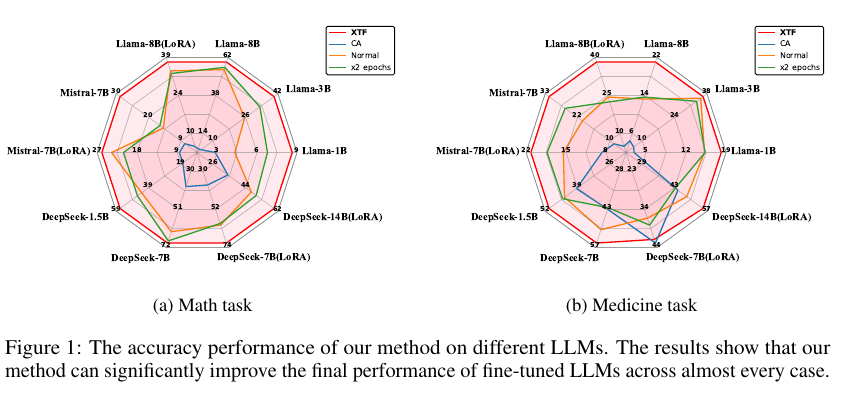

**Figure 1：** XTF 在不同 LLM 上的准确率表现。结果显示，在几乎所有情况下，XTF 都能显著提升微调后 LLM 的最终性能。

实现微调中的 token 级数据集优化，需要过滤输出标签中对最终性能无贡献的 token，这并不简单。第一，现有研究尚未清楚解释标签中单个 token 与微调效果之间的关系。第二，微调性能同时依赖基础模型已有知识和目标任务特性。过滤噪声 token 时必须同时考虑基础模型对数据的理解，以及数据与下游任务的相关性。因此，微调数据集中的噪声 token 过滤需要综合考虑微调任务要求，而不能依赖单一评价标准。

基于上述动机，作者提出可解释 token 级数据过滤方法 XTF。XTF 包含三个阶段：

1. 将数据对微调效果的贡献分解为三个属性：推理重要性、知识新颖性和任务相关性，并基于这些属性定义噪声 token 的判定标准。
2. 围绕微调的两个关键因素（基础模型与任务数据集），为三个属性设计计算成本可控的评分机制。
3. 根据统计结果识别噪声 token，并在训练过程中 mask 这些 token 对应的梯度，从而提升微调后 LLM 的性能。

作者在 3 类下游任务和 7 个代表性 LLM 上进行了实验。Figure 1 显示，XTF 在数学任务和医学任务上分别最高实现 13.3% 和 13.7% 的准确率优化；在代码生成任务上，XTF 在 `pass@1`、`pass@5` 和 `pass@10` 上分别最高提升 5.6%、5.6% 和 6.3%。

本文主要贡献包括：

- 揭示 LLM 微调中 token 级数据优化的研究空白。
- 提出通过推理重要性、知识新颖性和任务相关性三个分解属性过滤微调数据集中 token 级噪声的方法 XTF。
- 在多个代表性 LLM 和下游任务上验证 XTF 的微调优化效果，并展示属性分解策略用于解释复杂训练机制的潜力。

> [!IMPORTANT] 关键结论
> XTF 的强假设是：如果一个 token 完全缺失 RI、KN 或 TR 中任意一个属性，它就可以被视为噪声。这个“任一维度缺失即过滤”的规则是后续方法和理论分析的核心。

### 2. Background And Related Work

#### 2.1 Large Language Models Fine-Tuning

微调大模型被广泛认为是提升下游任务性能的关键技术。许多面向任务的模型都是通过微调高性能基础模型得到的，例如 Llama-Math 和 Llama-Finance。微调数据集质量是决定微调效果的重要因素，因此数据优化对于增强微调结果至关重要。

#### 2.2 Explainability For LLMs

LLM 可解释性方法旨在解释模型的决策机制和行为逻辑。然而，当前技术主要关注推理过程，对 token 与微调结果之间关系的解释研究仍较有限。

#### 2.3 Token-Level Training

若干先驱工作探索了训练中的 token 级数据精炼，主要包括数据蒸馏、直接模型训练和人类偏好训练。数据蒸馏方法主要关注 student model 从 token 级输出（logits）和句子级输出学习时的性能差异，而不是区分单个 token 的价值。直接模型训练使用 loss 变化指导有价值 token 的选择，但往往隐含假设高质量数据集是完全无噪声的。作者认为这一假设在微调任务中很少成立，因为基础模型通常已有较强能力，数据质量难以达到完全无噪声的标准。人类偏好训练则常依赖有标注文本对的先验知识和专门 token-level reward model，难以推广到更广泛场景。

> [!TIP] 读法提示
> Related Work 的主线是排除“已有方法已经解决”的可能性：样本级过滤太粗，预训练 token selection 假设太强，偏好优化依赖额外标注对，知识蒸馏目标又不同。

### 3. Methodology

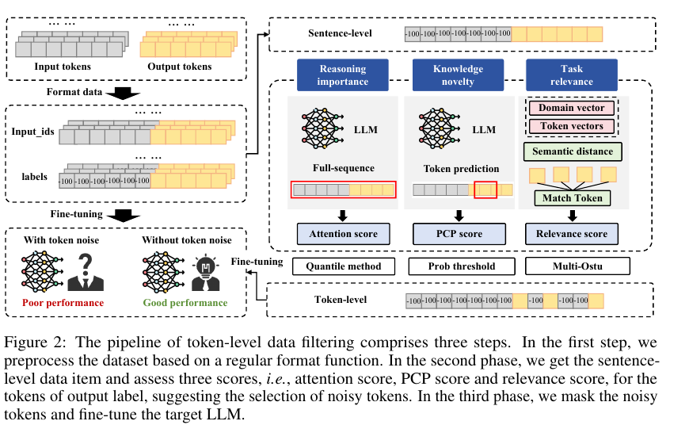

**Figure 2：** token 级数据过滤流水线包含三步：先按常规格式函数预处理数据；再对输出标签 token 计算 attention score、PCP score 和 relevance score；最后 mask 噪声 token，并微调目标 LLM。

#### 3.1 Which Data Acts As Noise For Fine-Tuning?

由于尺度差异，直观评估 token 级数据对最终微调结果的影响非常困难。因此，作者尝试通过理论分析，从三个属性解释 token 数据对微调的贡献。

微调过程可以被理解为高性能基础模型与任务特定数据集之间的对齐。因此，微调后模型性能受到三个因素影响：基础模型的认知、任务数据集中的知识，以及基础模型与任务数据集之间的矛盾。当要从标签句子中 mask 某个 token 时，可以从这三个角度评估其潜在影响。具体而言，作者提出三个对微调过程有正向影响的属性：

- **Reasoning Importance (RI)：** token 是否显著影响基础模型的推理结果。
- **Knowledge Novelty (KN)：** token 对基础模型而言是否包含新知识。
- **Task Relevance (TR)：** token 是否与任务数据集目标相关。

同时考虑三个属性并给出一个综合分数并不可行，因为目前没有明确依据决定它们之间的关系或层级顺序。不过，仍可用这三个属性识别噪声 token：如果一个 token 完全缺少任意一个属性，就可以被视为噪声。形式化地，微调任务中的 token 级噪声可表示为：

$$
D_{\text{noise}} = D_{RI\downarrow} \cup D_{KN\downarrow} \cup D_{TR\downarrow}
\tag{1}
$$

其中 $D_{RI\downarrow}$、$D_{KN\downarrow}$ 和 $D_{TR\downarrow}$ 分别表示缺乏推理重要性、知识新颖性和任务相关性的数据。

> [!NOTE] 公式注
> Eq. (1) 使用并集而非交集，意味着 XTF 采取较积极的过滤策略：只要某个 token 在任一属性上被判为明显缺失，就会进入候选噪声集合。

#### 3.2 How To Assess Tokens?

获得三个属性并定义噪声数据后，作者使用参数化评分机制分别评估三个属性，并识别数据集中的噪声 token。评分方法需满足两个现实要求：计算成本可控，以及同时考虑基础模型和数据。因此，作者采用三种推理级可解释方法分别评估三个属性。

**Attention Score for RI.** 作者使用基础模型的 attention score 评估推理重要性。Attention 是基础模型预训练过程中自适应学习 token 上下文重要性的机制。作者将完整文本（输入句子与输出标签句子）输入模型并计算 attention score。输出标签中第 $k$ 个 token 的推理重要性分数定义为：

$$
S_{RI}(O_k) = A(\theta, I + O)[l_I + k]
\tag{2}
$$

其中 $\theta$ 表示基础模型参数，$A$ 是计算 attention value 的函数，$I$ 和 $O$ 分别表示输入 token 与输出标签，$l_I$ 是输入 token 长度。

**PCP Score for KN.** 对于知识新颖性，作者采用基础模型正确 token 预测概率（PCP）。直觉上，预测概率越低，表示模型对该 token 越不确信，因此它更可能包含模型尚未获得的知识。知识新颖性分数定义为：

$$
S_{KN}(O_k) = 1 - P(O_k \mid I + [O_0, O_1, \ldots, O_{k-1}])
\tag{3}
$$

**Distance Score for TR.** 对于任务相关性，作者基于基础模型 embedding layer 计算语义距离。首先，把数据集中每个数据项完整输入基础模型，取 embedding layer 向量平均值作为微调任务的 domain vector。然后收集数据集中出现的所有 token，并计算它们的 context-free embedding vectors。最后，测量这些 token vectors 与 domain vector 的距离，并用该距离得到 relevance score：

$$
V(\text{Domain}) = \frac{\sum E(\theta, exp_w)}{n_w}
$$

$$
S_{TR}(O_k)=1-\operatorname{Normalize}\left(D(E(O_k), V(\text{Domain}))\right)
\tag{4}
$$

其中 $E$ 表示获取输入 embedding vector 的函数，$exp_w$ 和 $n_w$ 分别表示 expert words 及其数量，$D$ 表示计算两个向量距离的函数。

#### 3.3 How To Fine-Tune Based On Scores?

**Token Filtering.** 获得每个维度的分数后，需要基于分数过滤噪声 token。Figure 3 展示不同任务中三类分数的分布特征。

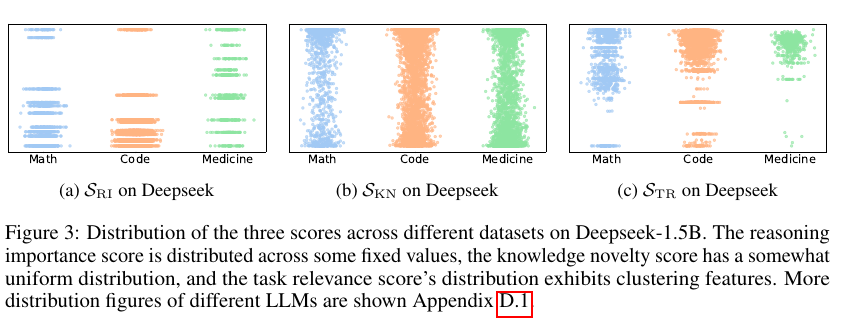

**Figure 3：** Deepseek-1.5B 上三类分数在不同数据集中的分布。RI score 分布在一些固定值上；KN score 较接近均匀分布；TR score 呈现聚类特征。

推理重要性分数呈现极端分布：许多分数取相同值，归一化后差异明显。因此作者直接应用四分位方法（Interquartile Range, IQR）过滤极低分 token：

$$
Q_1,Q_3 = \operatorname{Quantile}(S_{RI}(O), [25,75])
$$

$$
IQR = Q_1 - (Q_3-Q_1)
$$

$$
O_k \in D_{RI\downarrow}\quad \text{if}\quad S_{RI}(O_k) < Q_1-IQR
\tag{5}
$$

知识新颖性分数呈均匀分布，低分难以区分，因此作者采用启发式阈值：若 token 的 PCP 高于 95%，则认为它只包含无新颖性的知识，并把它视为噪声：

$$
O_k \in D_{KN\downarrow}\quad \text{if}\quad S_{KN}(O_k)<0.05
\tag{6}
$$

任务相关性分数呈现聚类特征，因此作者使用 Multi-Otsu 方法对分数划分。由于均值最小的簇通常是空格替换符号，作者过滤均值第二小的簇：

$$
O_k \in D_{TR\downarrow}\quad \text{if}\quad S_{TR}(O_k)\in M(S_{TR})_{\text{2nd}}
\tag{7}
$$

其中 $M$ 是 Multi-Otsu 方法，$M(S_{TR})_{\text{2nd}}$ 表示均值第二小的簇。

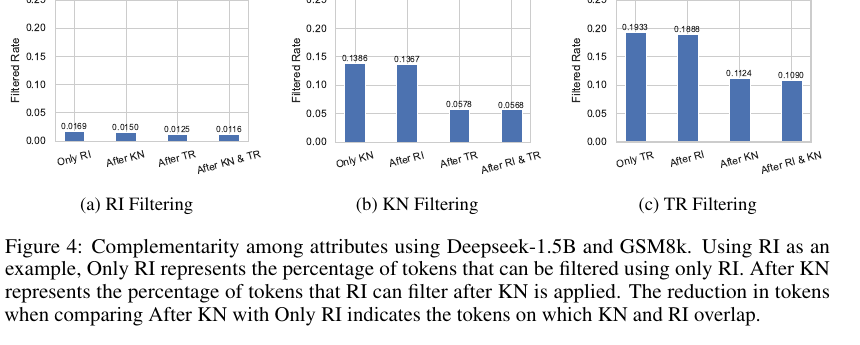

**Figure 4：** 在 Deepseek-1.5B 和 GSM8K 上三个属性的互补性。不同属性过滤出的 token 重叠不高，说明多个角度能弥补单一角度遗漏的噪声。

**Threshold Analysis.** XTF 采用积极过滤策略，即取三类过滤 token 的并集。支撑这一策略的前提是：被过滤 token 应该“完全”缺少相应属性，因此选择保守阈值，只过滤显著低分 token。与此同时，多维属性过滤具有互补作用，可以弥补宽松阈值带来的噪声遗漏。

**Training the Model.** 训练时，由于微调任务只关注输出正确性，常规处理会把输入 token 标为默认忽略值（通常为 `-100`），使其不参与梯度计算。识别输出标签中的噪声 token 后，作者也将它们标记为这一默认值，并用结果数据进行微调。给定噪声 token 列表 $N$，学习一个数据项的 loss 表示为：

$$
L_F = - \sum_{O_k\notin N}
\log P\left(O_k \mid I + [O_0,O_1,\ldots,O_{k-1}]\right)
\tag{8}
$$

> [!IMPORTANT] 关键点
> XTF 不改变模型结构，也不需要训练额外 reward model；它改变的是训练样本的 label mask，使部分输出 token 不再产生训练梯度。

### 4. Experiments

#### 4.1 Experiment Settings

**Dataset.** 作者选择三类代表性下游任务评估微调性能：数学、代码和医学。数学任务使用 GSM8K 进行微调和评估；代码任务在 CodeExercise 上微调，并用 HumanEval 评估；医学任务使用 PubMedQA 微调和评估。附录还提供 NuminaMath-CoT、MATH-500 和 FIQA 等额外实验。

**LLMs.** 作者从 DeepSeek、Llama 和 Mistral 三个模型家族中选择 7 个不同规模的基础 LLM：DeepSeek-R1-distilled-Qwen-1.5B/7B/14B，Llama-3.2-1B/3B，Llama-3.1-8B，以及 Mistral-v0.1-7B。

**Baselines.** 实验比较 3 种常规 LLM 实现和 4 种数据增强/优化方法：CA（原始基础模型）、Normal（常规微调）、$\times 2$ epochs、DF、DA、SLM 和 TC。

**Metrics.** 作者主要使用 accuracy 评估特定任务上的 LLM 表现。对于代码补全任务，使用 `pass@1`、`pass@5` 和 `pass@10`。

#### 4.2 Main Experiment Results

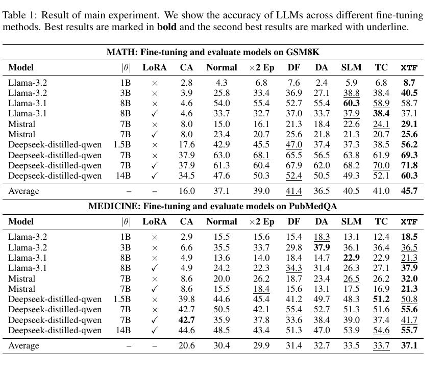

**Table 1：** 主实验结果。表中展示不同微调方法下各 LLM 的准确率；加粗为最佳结果，下划线为第二好结果。

**Math.** 数学是 LLM 研究中的重要下游任务。Table 1 显示，XTF 平均比常规微调高 8.6% accuracy，比最佳 baseline DF 高 4.3%。在 10 个 case 中，XTF 获得 8 个最佳结果和 2 个第二好结果。尤其在全参数微调 Deepseek-distilled-qwen-1.5B 时，XTF 比常规微调高 13.3%，比最佳 baseline DF 高 9.3%。

**Medicine.** 医学是 LLM 的重要应用领域。Table 1 显示，XTF 平均比常规微调高 6.7%，比最佳 baseline TC 高 3.4%。在 10 个 case 中，XTF 获得 6 个最佳结果和 4 个第二好结果。在 LoRA 微调 Llama-3.1-8B 时，XTF 比常规微调高 13.7%。

**Code.** 代码任务更具挑战性。由于代码任务整体准确率较低，XTF 与 baseline 的差距没有其他任务显著。但 Figure 5 显示，XTF 通常优于常规微调，且当生成机会从 `pass@1` 增加到 `pass@10` 时，这一差异扩大。

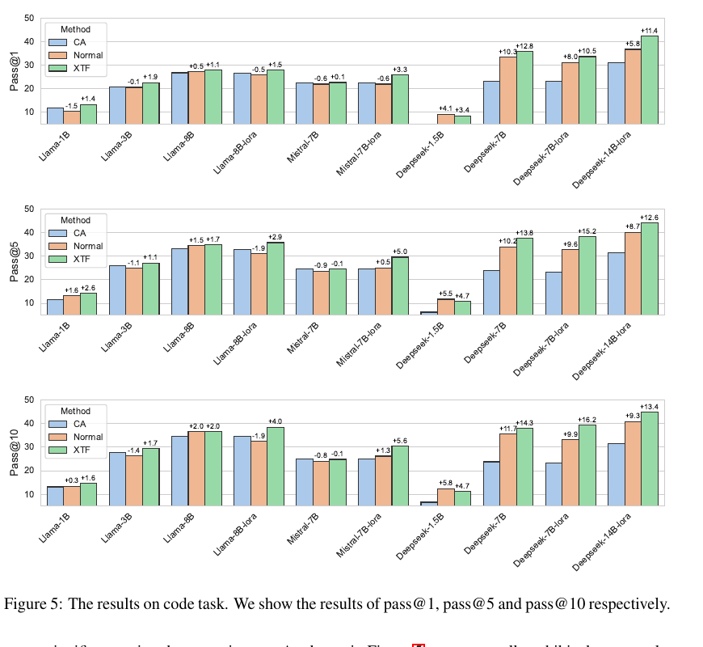

**Figure 5：** 代码任务上的 `pass@1`、`pass@5` 和 `pass@10` 结果。部分 case 中常规微调会降低准确率，说明噪声 token 可能有害，而 XTF 仍表现为正向提升。

> [!TIP] 读法提示
> 代码任务中 XTF 对大模型更明显，这与论文主张一致：噪声识别需要考虑基础模型已有知识；基础模型越强，越能利用 XTF 的 token 过滤策略。

#### 4.3 Ablation Study

作者对三个噪声过滤属性进行消融，只选择部分属性过滤噪声 token，并训练不同模型系列。

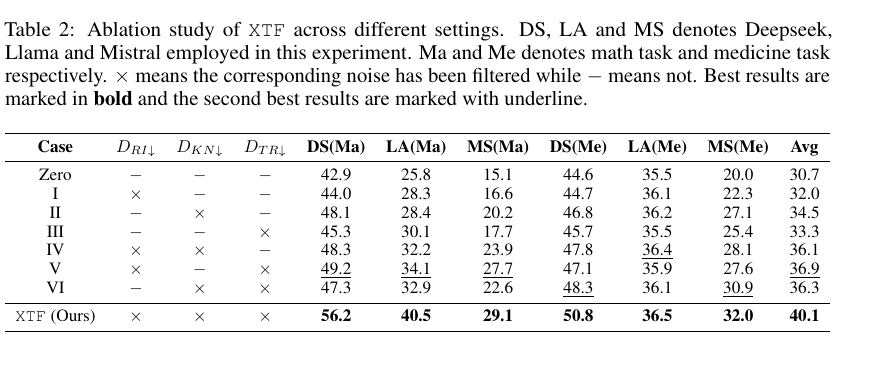

**Table 2：** XTF 在不同设置下的消融实验。$D_{RI\downarrow}$、$D_{KN\downarrow}$、$D_{TR\downarrow}$ 分别表示过滤对应属性缺失的噪声；`×` 表示过滤该类噪声，`-` 表示不过滤。

Table 2 显示，XTF 始终优于其他设置，说明三个属性对更好的噪声过滤都是必要的。同时，在数学任务中，RI+KN 的组合通常优于其他组合；但医学任务中并非如此，不同模型上的最优组合也不同。这说明三个属性的相对有效性会随模型和任务类型变化，与 Section 3.1 对微调机制的理解一致。

### 5. Discussion

XTF 能有效增强 LLM 微调，但仍有局限。首先在计算成本方面，XTF 会引入推理级计算开销。相比需要训练 reference model 的已有方法，它成本更优，但在处理大模型时仍然负担较重。如果可以用小型蒸馏模型为大规模基础模型识别噪声，将显著降低 token scoring 成本。其次，作者认为还可以探索更多用于噪声过滤的属性，并从多个角度评估这些属性，从而补充 XTF 在真实场景中的应用。

> [!WARNING] 限制
> XTF 需要对大量 token 计算 attention、PCP 和 embedding distance 分数，因此它不是“零成本”的数据清洗方法。论文提出未来可用小模型代理大模型进行噪声识别，但本文并未解决这个问题。

### 6. Conclusion

本文研究训练数据在 token 级别上对微调性能的影响。作者通过三个分解维度（推理重要性、知识新颖性、任务相关性）探索过滤 token 级噪声以优化微调数据集的方法，并提出 XTF。作者在 3 类不同下游任务和 7 个代表性 LLM 上进行了大量实验。XTF 在数学、医学和代码任务上分别最高实现 13.3%、13.7% 和 6.3% 的准确率优化，并整体优于所有 baseline，证明其在噪声过滤和微调增强方面的有效性。

## Appendix Notes

### Appendix A: Theoretical Foundations Of XTF

附录 A 提供 XTF 的理论基础。核心目标是说明：过滤 token 后，训练方向与“理想梯度方向”之间的对齐会改善。作者采用 Riemannian/Fisher 几何视角，并把分析推广到任意对称正定（SPD）预条件矩阵 $M$，其中 $M=F_\lambda$ 对应自然梯度，$M=I$ 对应欧氏 SGD。

主要符号包括：

$$
\phi_\theta(c,t)=\nabla_\theta \log p_\theta(t\mid c)
$$

$$
F_\lambda(\theta)=
\mathbb{E}_{c\sim Q}\mathbb{E}_{t\sim p_\theta(\cdot\mid c)}
\left[\phi_\theta(c,t)\phi_\theta(c,t)^\top\right]+\lambda I
$$

理想风险定义为：

$$
L^\star(\theta)=
\mathbb{E}_{(c,t)\sim p^\star}\left[-\log p_\theta(t\mid c)\right]
=\operatorname{KL}(p^\star\Vert p_\theta)+\text{const.}
$$

作者假设训练分布由 core 与 noise 混合：

$$
p_{\text{train}}(c,t)=(1-\epsilon)p_{\text{core}}(c,t)+\epsilon p_{\text{noise}}(c,t),
\quad p_{\text{core}}\equiv p^\star
$$

在 selector 具备非平凡能力（$\alpha+\beta<1$）且 noise 与 core 梯度弱不相干的条件下，过滤后 alignment 增益为正。核心结论可概括为：

$$
A_M^{fil}(\theta)-A_M^{train}(\theta)
=
\frac{(1-\epsilon)\epsilon(1-\alpha-\beta)}{Z_{fil}}
\left(
\|g_{\text{core}}\|^2_{M^{-1}}
-
\langle g_{\text{core}},g_{\text{noise}}\rangle_{M^{-1}}
\right)
$$

若存在 $\zeta_M<1$ 使得：

$$
\langle g_{\text{core}},g_{\text{noise}}\rangle_{M^{-1}}
\le
\zeta_M\|g_{\text{core}}\|^2_{M^{-1}},
$$

则 alignment gain 有严格正下界。

> [!NOTE] 理论注
> 附录理论并不是证明每个具体阈值一定最优，而是证明在若干透明假设下，“有技能的 token 过滤器”会让训练方向更接近理想任务梯度方向。

附录还证明高置信 KN token 的 Fisher 贡献随 $\delta$ 变小而趋近于 0：若 $p_\theta(t\mid c)\ge 1-\delta$，则其贡献可被 $O(\delta)$ 约束。这为过滤高 PCP token 提供理论支撑。

### Appendix B: More Details

Appendix B 补充 Multi-Otsu 方法、baseline 设置和超参数。Multi-Otsu 通过最大化类间方差选择多个阈值；baseline 包括 CA、Normal、$\times 2$ epochs、DA、DF、SLM 和 TC。超参数见 Table 3。

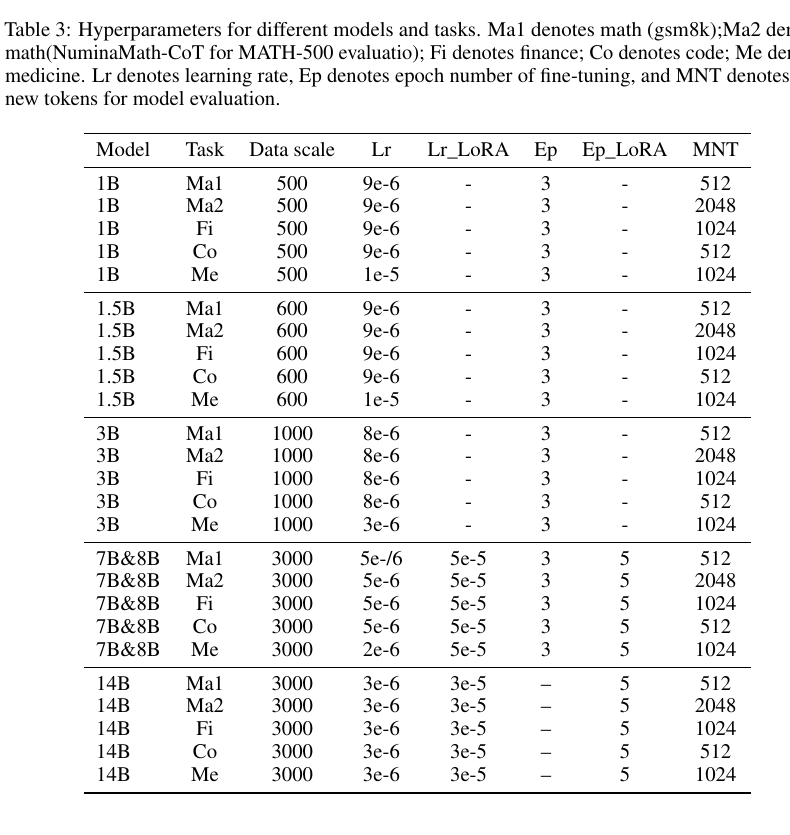

**Table 3：** 不同模型和任务的超参数。Ma1 表示 GSM8K 数学任务，Ma2 表示 NuminaMath-CoT/MATH-500，Fi 表示金融，Co 表示代码，Me 表示医学。

### Appendix C: More Experiment Results

Appendix C 提供扩展主实验和阈值消融。扩展实验包含两个设置：在 NuminaMath-CoT 上微调并在 MATH-500 上评估；在 FIQA 上端到端微调和评估。

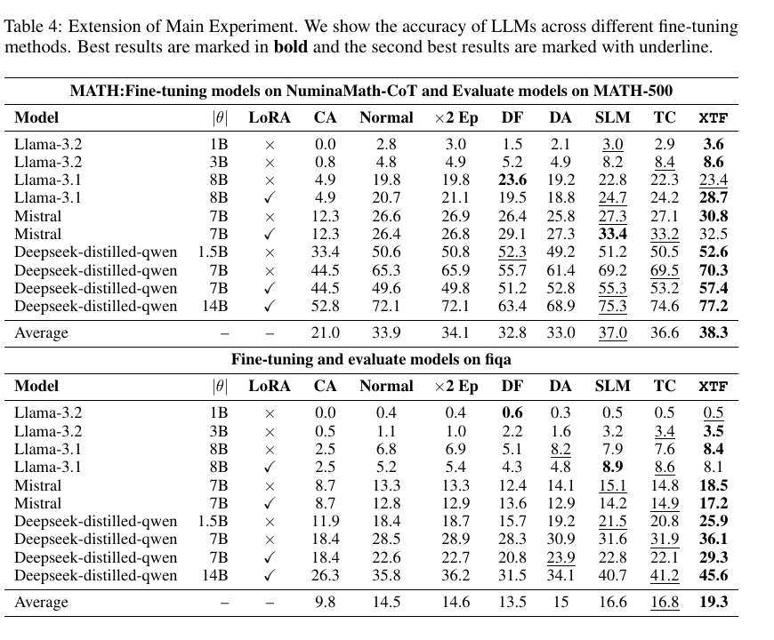

**Table 4：** 扩展主实验结果。数学任务中，XTF 平均比常规微调高 4.6%，比最佳 baseline SLM 高 1.3%；金融任务中，XTF 平均比常规微调高 4.8%，比最佳 baseline TC 高 2.5%。

阈值消融显示，直接调整阈值会显著影响过滤 token 数量；RI 阈值略微增大可能导致超过 70% 的 token 被过滤；KN 中 PCP 每变化 1%，对应约 2% 的全部 token；TR 的阈值上调或下调也都会带来明显变化。

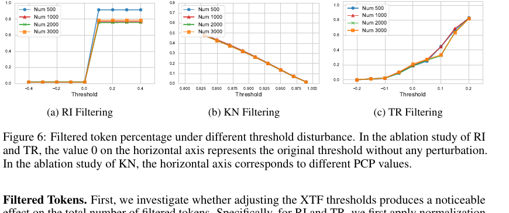

**Figure 6：** 不同阈值扰动下过滤 token 的比例。RI 和 TR 中横轴 0 表示原始阈值；KN 中横轴表示不同 PCP 值。

作者还进一步做了阈值合理性的消融：不是直接移动阈值，而是按分数排序，扰动每个句子中各属性过滤 token 的比例（$\pm 3\%$），组合得到 27 个 case。

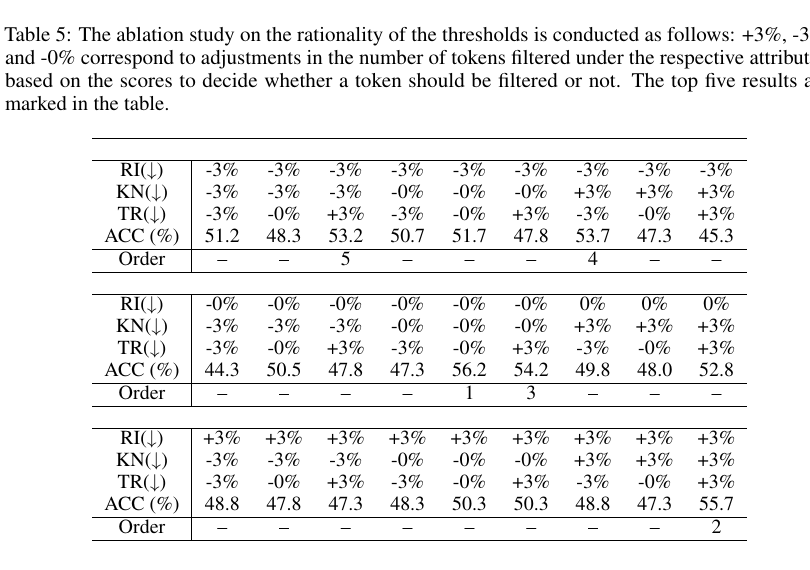

**Table 5：** 阈值合理性消融。`+3%`、`-3%` 和 `-0%` 分别表示在对应属性下调整被过滤 token 数量；表中标出了前五名结果。作者发现基于统计原则得到的原始阈值在所有 case 中获得最佳微调性能。

> [!NOTE] 方法注
> 这个消融说明：事后简单微调阈值并不稳定，某些替代阈值可能偶然接近最佳，但没有线性或正态等一致模式，因此难以形成可靠的通用阈值调整规则。

### Appendix D: Computational Overhead

Appendix D 分析 XTF 的计算开销，重点区分“推理级成本”和“训练级成本”。作者在 6 个模型上测量评分过程的显存和时间开销。

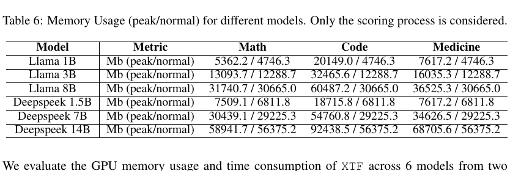

**Table 6：** 不同模型的显存使用（peak/normal），只考虑 scoring process。代码数据集最大序列长度更长，因此 peak memory 更高。

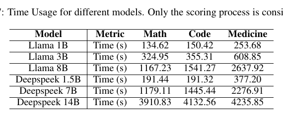

**Table 7：** 不同模型的时间使用，只考虑 scoring process。

作者指出，XTF 的 GPU 显存消耗处于推理级，接近模型加载所需显存，不会显著增加 peak memory。时间消耗主要由数据集平均序列长度决定；Medicine 数据集平均序列长度为 401，长于 Math 的 181 和 Code 的 236，因此时间成本最高。虽然模型规模越大计算成本越高，但 XTF 的理论开销仍显著低于需要训练额外 reference model 的 token-level baseline（如 SLM）。

成本可分为两类：

- **训练级成本**：SLM 和 TC 等 token-level baseline 需要训练 reference model，并在原模型和 reference model 上做推理以获得 token-level loss。
- **推理级成本**：DF、DA 等 sample-level 方法属于这一类；XTF 虽然是 token-level 方法，但只需两次推理完成过滤。第一次推理得到 logits 和 attention，用于 RI、KN 和 TR 的 domain vector；第二次推理计算每个 token 的 TR score。

> [!WARNING] 成本边界
> XTF 比训练 reference model 的 token-level 方法便宜，但仍需要额外推理评分；对于超大模型或超长上下文数据集，这部分成本仍需要纳入工程预算。

#### Appendix D.1 Distribution Figures

Appendix D.1 展示不同 LLM 上三类分数的更多分布图。虽然不同模型或数据集的分布有差异，但整体仍符合 Section 3 的模式：RI score 常集中在若干固定值，仅有少量极端值；KN score 相对均匀，难以直接切分；TR score 具有明显聚类特征，适合通过聚类方法划分。

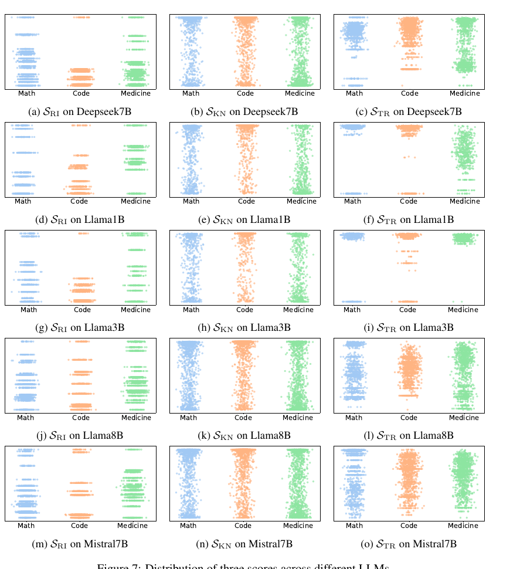

**Figure 7：** 不同 LLM 上三类分数的分布。

### Appendix E: LLM Usage

论文声明使用 OpenAI LLM（GPT-4o）作为写作和格式辅助工具，主要用于改进 figure/table caption 的语法、措辞、清晰度和布局，例如列对齐、caption 长度和位置。作者强调模型仅用于表层文本和视觉编辑，没有参与研究想法、实验设计、数据分析或技术内容。所有输出均由作者审阅和修改，作者对最终文本和图表负责。

### Appendix F: Examples For Token-Level Noise

Appendix F 展示 token 级噪声过滤的具体示例。图中黄色部分表示根据对应分数过滤出的噪声 token。作者特别指出，XTF 的过滤决策有时可能比人类直觉更可靠。例如在 GSM8K 中，与数学运算相关的符号（如 `+`、`=`）或具体计算结果并不总是微调所必需；从 KN 角度看，如果基础模型已经能以超过 95% 的概率预测这些 token，那么学习推理逻辑可能比记忆符号或具体结果更重要。

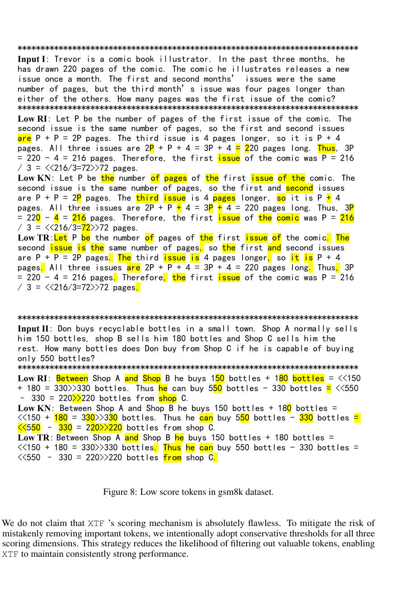

**Figure 8：** GSM8K 数据集中的低分 token。

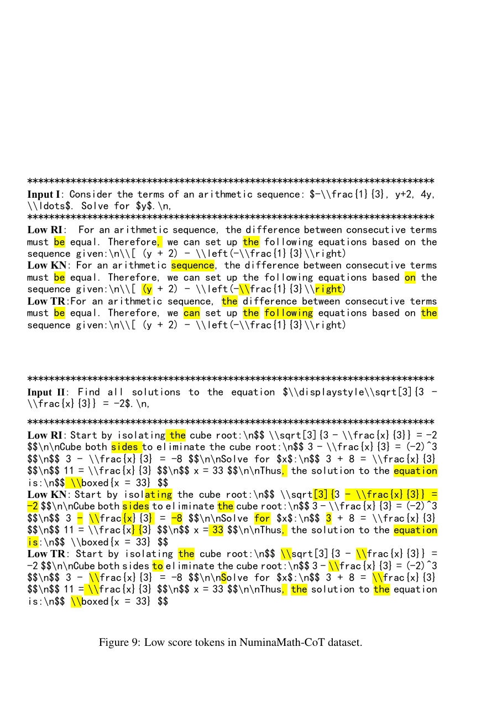

**Figure 9：** NuminaMath-CoT 数据集中的低分 token。

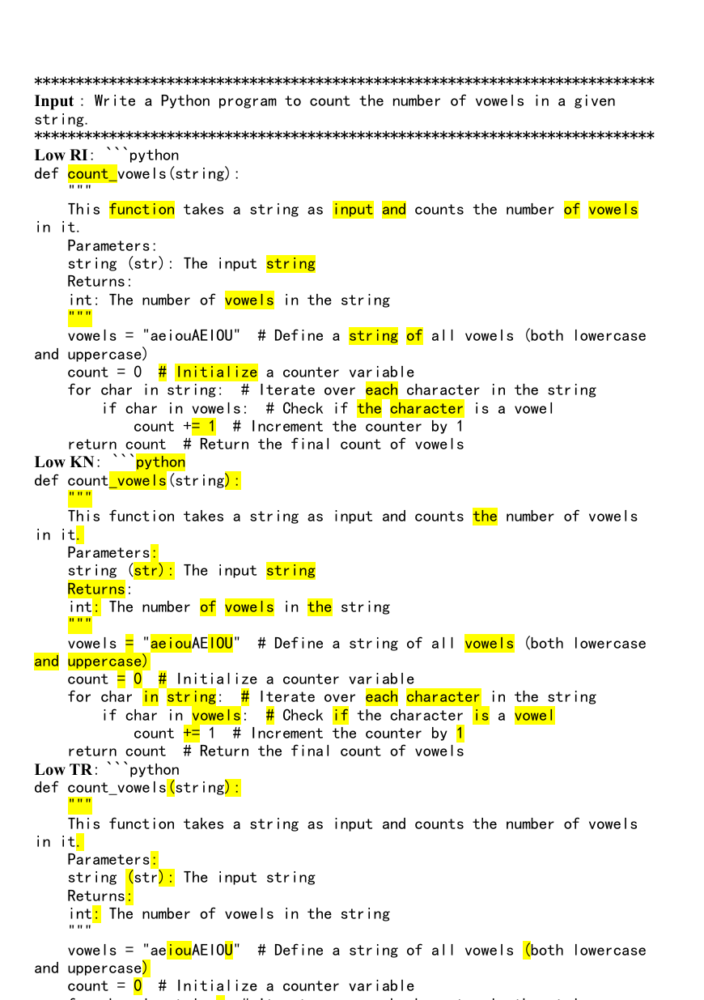

**Figure 10：** CodeExercise-Python-27k 数据集中的低分 token。

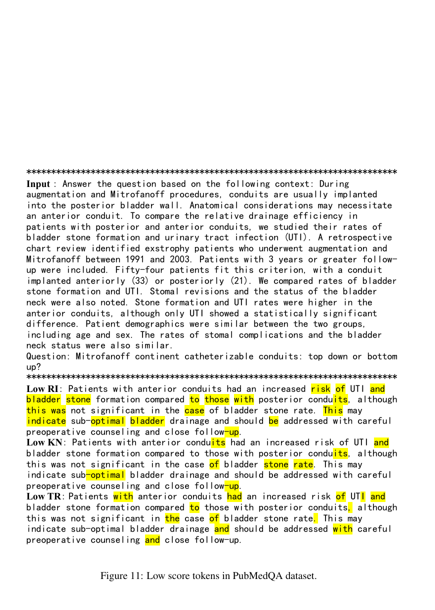

**Figure 11：** PubMedQA 数据集中的低分 token。

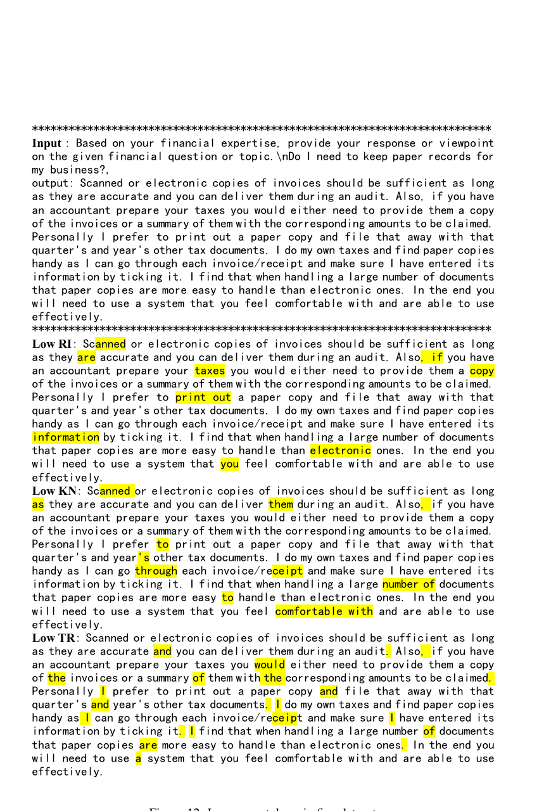

**Figure 12：** FIQA 数据集中的低分 token。

作者并不声称 XTF 的评分机制绝对完美。为降低误删重要 token 的风险，XTF 在三个评分维度上都采用保守阈值，从而减少过滤有价值 token 的可能性，并保持较稳定性能。

> [!WARNING] 阅读边界
> 附录 A 的理论依赖 mixture model、selector quality、weak incoherence 等假设；附录实验则主要支持经验有效性。阅读时应把理论保证理解为“在透明假设下解释为什么过滤可能改善方向对齐”，而不是无条件保证任意数据集和模型都提升。

## Figure And Table Reading Notes

- **Figure 1**：用雷达图展示数学和医学任务中 XTF、CA、Normal、$\times 2$ epochs 的准确率对比，XTF 基本覆盖更外层区域。
- **Figure 2**：是方法总览图，最值得先看。它把常规 sentence-level label 转换为 token-level mask 的流程串起来。
- **Figure 3**：解释为什么三个属性需要不同阈值策略：RI 极端、KN 近似均匀、TR 聚类。
- **Figure 4**：显示三个属性过滤集合互补，支持并集过滤策略。
- **Table 1**：主实验核心证据，数学与医学任务上 XTF 平均最优。
- **Figure 5**：代码任务结果，XTF 在多次生成指标上优势更明显。
- **Table 2**：属性消融，证明 RI、KN、TR 三个维度共同使用最好。
- **Table 4 / Figure 6**：附录扩展实验与阈值敏感性，说明方法优势和阈值选择的重要性。
- **Table 5**：阈值比例扰动消融，说明统计阈值优于简单事后调整。
- **Table 6 / Table 7**：计算开销分析，说明 XTF 是推理级额外成本。
- **Figure 7**：不同模型上的分数分布，支持三种属性采用不同阈值策略。
- **Figure 8-12**：具体 token 过滤示例，展示 XTF 可能过滤掉人类直觉认为有用但模型已掌握的 token。

## Method Map

1. **问题定位**：微调数据是句子级，但 LLM loss 是 token 级，完整训练标签句子可能引入 token 级噪声。
2. **属性分解**：把 token 对微调的贡献拆成 RI、KN、TR 三个属性。
3. **噪声定义**：若 token 显著缺失任一属性，则纳入噪声候选集合：$D_{\text{noise}}=D_{RI\downarrow}\cup D_{KN\downarrow}\cup D_{TR\downarrow}$。
4. **评分机制**：RI 用 attention score，KN 用 $1-\text{PCP}$，TR 用 token embedding 与 task domain vector 的距离。
5. **阈值过滤**：RI 用 IQR，KN 用 PCP 0.95 启发式，TR 用 Multi-Otsu 聚类。
6. **训练实现**：将噪声 token label 改为 `-100`，不参与 loss。
7. **验证方式**：在数学、医学、代码任务和多个 LLM 家族上比较 CA、Normal、数据增强/过滤 baseline 与 XTF。

## Limitations And Open Questions

> [!WARNING] 计算成本
> XTF 需要为大量 token 计算三类分数，尤其在大模型上会产生明显推理级开销。

> [!WARNING] 阈值依赖
> 方法依赖 RI、KN、TR 的阈值选择。附录显示阈值扰动会显著改变过滤 token 比例，因此实际应用需要谨慎校准。

> [!WARNING] 理论假设
> 理论证明依赖 selector skill、mixture model、weak incoherence 等假设，现实数据是否满足这些假设需要实证检查。

> [!WARNING] 属性完备性
> RI、KN、TR 是作者选择的三个解释属性，但未证明它们覆盖所有与微调有用性相关的因素。作者也承认未来可探索更多属性。

## References

参考文献保留原论文编号与作者-年份引用形式。需要核对完整条目时，请参见源 PDF 的 References 部分。
